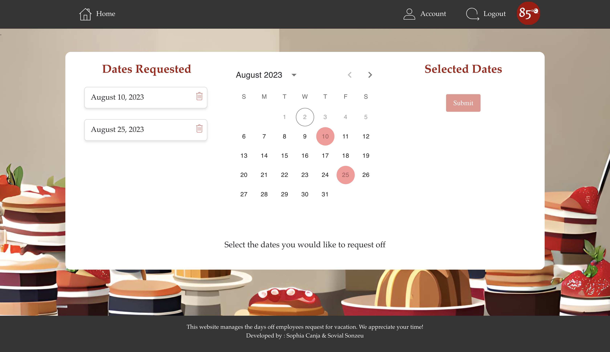
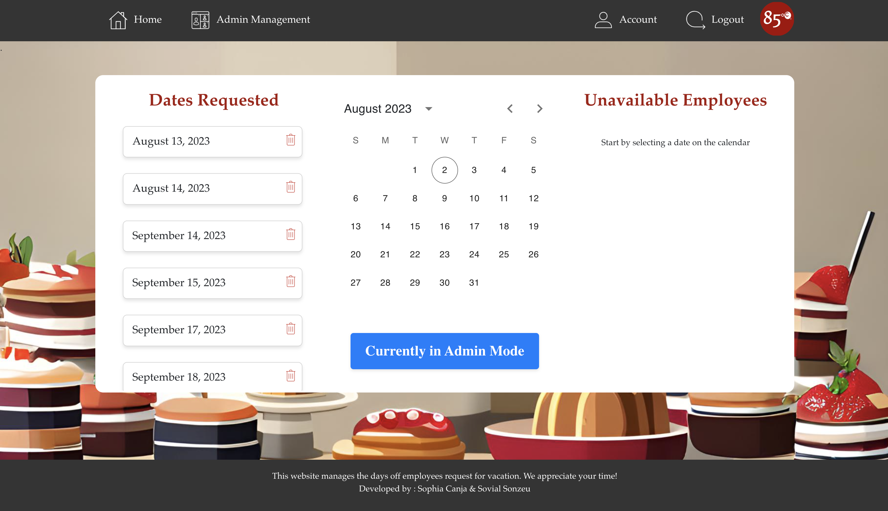
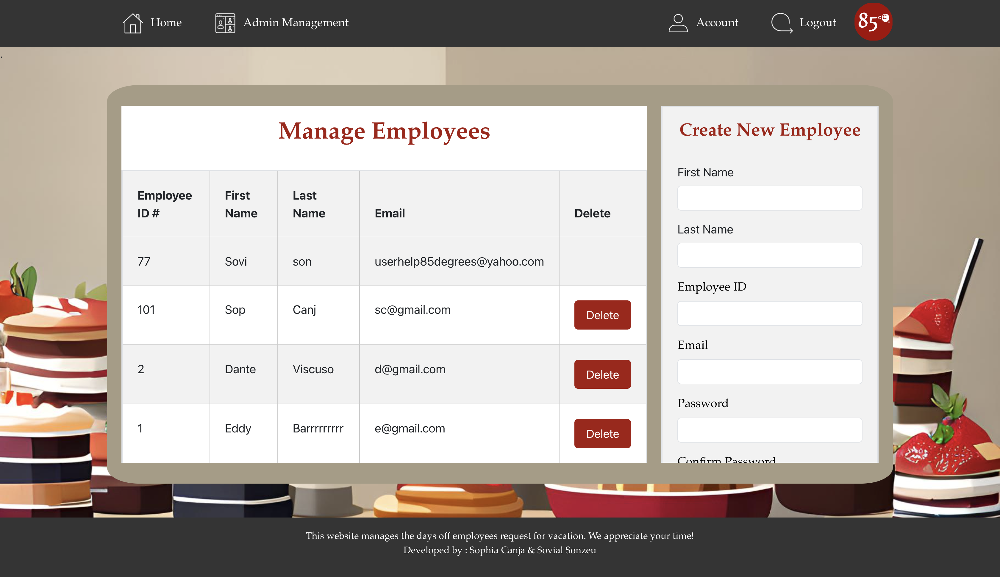
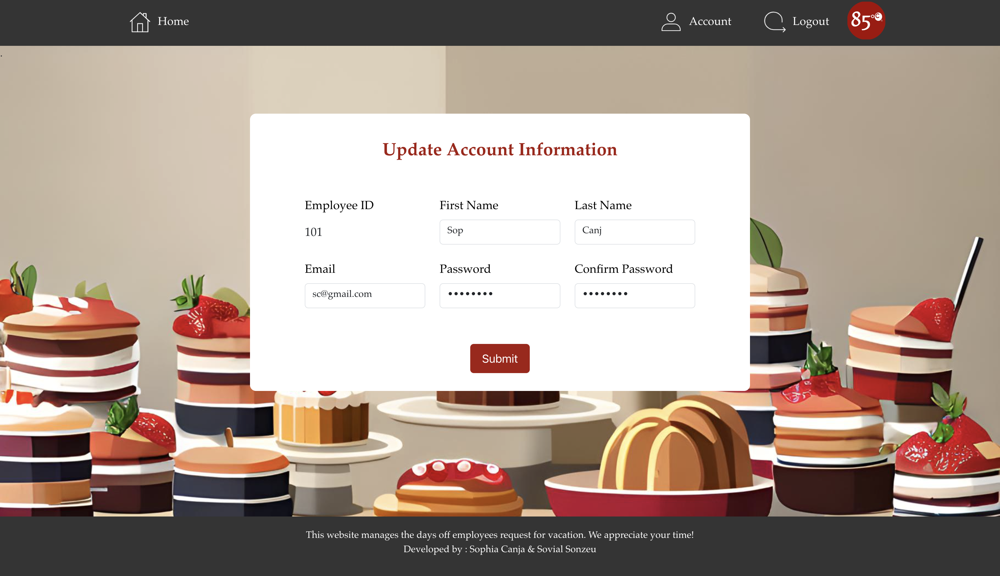
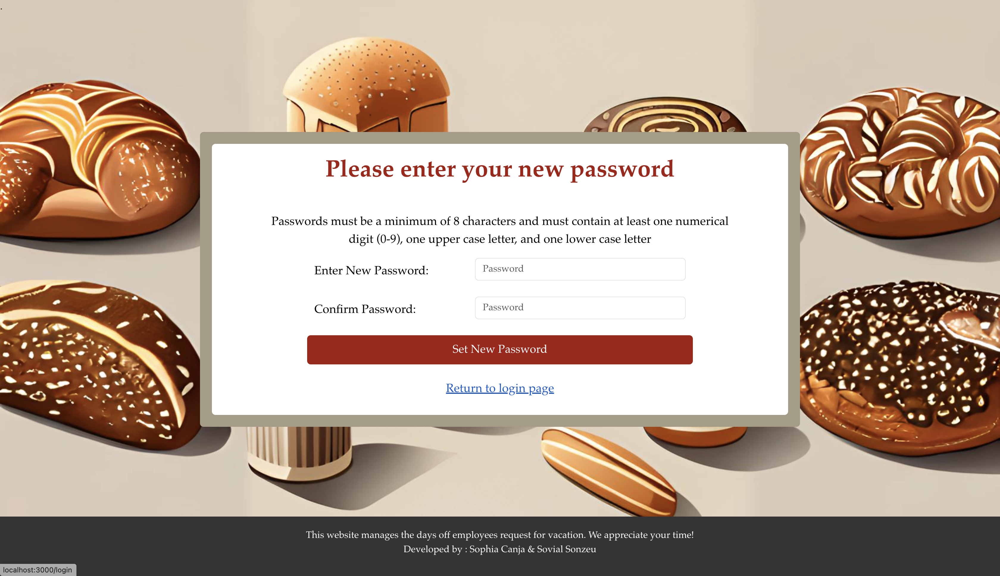

# 85c Bakery Request-Off Calendar 

This full-stack web application manages the days-off requested by employees for vacation.

## Description

Sophia Canja was the Cake Department Lead of her local 85c Bakery. Their department did not have an effective way for employees to request-off for vacation days. Originally, employees would text Sophia at the beginning of every month for the days they wanted off, however, this method resulted in multiple schedule conflicts and issues. 

This full-stack web application manages the days-off requested by employees for vacation. Employees are given an account where they can request the days they want off using a calendar that marks and highlights the dates. Employee accounts are able to select multiple dates, and submit or delete their requests. Administrator accounts will have the option to view a list of employees who requested off on specific days, as well as add or delete employees from the database. All accounts can update their personal information and can also create a new password using a unique link that is emailed to the user. Overall, this web application is a user friendly, simple interface that effectively manages requested days-off. 

The use of this application resulted in better communication between the manager and employees. Schedule conflicts were avoided, and schedule making became easier due to being able to see which employees could not work on specific days. These issues were prevalent and frequent, before the creation of this application. An anonymous survey amongst the staff displayed a 30% reduction in employee scheduling conflicts and received a 4.5/5 rating.

## Learning Opportunities

- Implementation of the MERN stack allows for understanding how components come together to create a fully functional web application 
- Experience using components, state management, responsive UI using React, Bootstrap, and CSS
- Working with API’s, handling HTTP requests, and understanding routing
- Enabling user authentication and authorization by handling user login, session management, and securing sensitive routes with JSON Web Tokens (JWTs)
- Interaction with a NoSQL database to manage data and perform CRUD operations 
- Built a RESTful API to communicate between the front-end and back-end 
- Utilizing Git for version control and project organization 
- Practicing Agile methodology in order to track progress and meet deadlines

## Technologies Used 
- Axios (API calls) 
- Bootstrap 
- Discord
- Express
- Git
- Infinite Image AI 
- JSON Web Tokens (JWT)
- Lottie (Lordicon) 
- Material UI
- Monday.com (Kanban Board)
- MongoDB
- Node.js
- Nodemailer
- NPM
- Postman
- React.js
- TomeAI

## Getting Started

### Dependencies 
* For Windows OS: node v14.15.5  (use node version manager to specify node version)

### Installing 

- `npm install i ` to install any absent dependencies/libraries
- `nodemon index.js` or `node index.js` to start backend
- `npm start` to start frontend

## Authors 
Sophia Canja 

Sovi Sonzeu [@Soviii](https://github.com/Soviii)

## Website Walkthrough and Screenshots
https://github.com/sophiacanja/85RequestOffCalendar/assets/94957224/d6a81a0e-98c8-4b97-8696-cc8248aa819c

